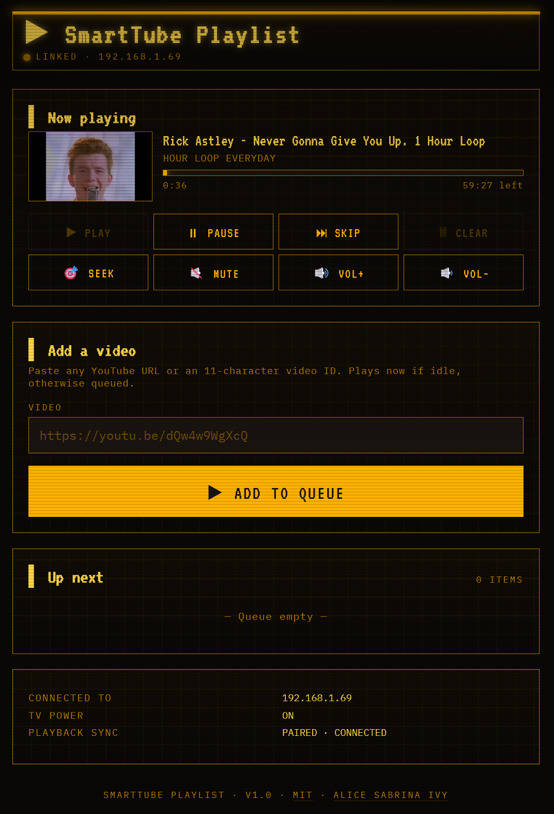

# SmartTube Playlist

A small, LAN-only web page that lets anyone on your home network paste a YouTube link and have it play on **SmartTube** on your **Google TV**. Several people can add videos at once; the queue plays through them in order.

No accounts to create and no third-party service to sign up for.

> **Not affiliated with Google, YouTube, or the SmartTube project.** This is an independent hobby project that talks to software you already run.



*Volume and mute work on both tested devices — see [Volume and mute](#volume-and-mute).*

---

## Project status — work in progress

This works, and it's used daily on the setup it was built for. It is not finished, and it has only been proven on the two devices below.

**Verified on real hardware:**

| Device | Pairing | Playback | Wake from off | Volume / mute |
|---|---|---|---|---|
| Google TV Streamer (4K) | ✓ | ✓ | ✓ | ✓ (via HDMI-CEC) |
| Chromecast with Google TV (4K) | ✓ | ✓ | ✓ | ✓ (device's own output — that TV has no CEC) |

Everything in that table was exercised end to end on the actual devices, including pairing, YouTube Lounge, pause/resume, auto-advance, the wake-from-sleep sequence, and returning the TV to its screensaver.

**Other Google TV and Android TV hardware** — Nvidia Shield, onn., Xiaomi and the rest — uses the same Android TV Remote v2 protocol and will most likely work, but nobody has confirmed it. Fire TV runs Fire OS and may not expose the Remote service at all. Tried one? Please [open an issue](https://github.com/Alice-Sabrina-Ivy/smarttube-playlist/issues) and say what happened, working or not.

Where this is heading: see [Roadmap](#roadmap).

Expect rough edges, occasional breaking changes between versions, and issues that take a while to get answered.

---

## Why this exists

SmartTube is the ad-free YouTube client for Android TV, but it doesn't support Google Cast — guests can't just hit the cast button. The official workaround (TV-code linking inside each guest's YouTube app) is a per-guest setup chore, awkward enough that most people give up and hand over the remote.

This is the easier alternative: one page on your LAN, anyone pastes a link, the video plays. Paste more links and they queue up behind it.

---

## What you'll need

- A **Google TV** device — verified on the Google TV Streamer and Chromecast with Google TV. Other Android TV hardware most likely works but is unconfirmed; see [Project status](#project-status--work-in-progress).
- **[SmartTube](https://smarttubeapp.github.io/)** installed on it. It's a separate project from this one, it isn't on the Play Store, and you install it yourself — **[Never heard of SmartTube?](#never-heard-of-smarttube)** walks you through it.
- A computer that can run Docker and stays on while you're watching — a PC, a Mac, a NAS, a Raspberry Pi (64-bit OS), whatever you have.
- Both on the **same network** as the TV.
- **An internet connection** on that computer — video titles and lengths come from YouTube, and playback commands relay through YouTube's servers. Only the web page itself is LAN-only.
- The TV's IP address (Settings → Network, or your router's device list).

**Give the TV a permanent address** if you can — most routers call this a *DHCP reservation* or *static lease*, usually in the router's device list. Optional, but if the TV's address changes this app stops finding it, and re-pairing means setting `RESET_PAIRING: "1"` in `docker-compose.yml` and restarting (the pairing screen is hidden once a TV is paired).

### Never heard of SmartTube?

[SmartTube](https://smarttubeapp.github.io/) is a free, ad-free YouTube app for TV devices. It plays the same YouTube you already know, without the adverts. It's a separate project from this one, and it's what this app sends your videos to — so you need it on the TV first.

**What can run it:** Android TV and Google TV devices — Chromecast with Google TV, Nvidia Shield, Xiaomi Mi Box, onn. boxes, and most Android TV set-top boxes and built-in Android TVs.

**What can't:** phones and tablets, Samsung (Tizen) and LG (webOS) TVs, Apple TV, and Roku. Fire TV sits in between — SmartTube supports older Fire TV devices but not the newest ones, and this app may not work with Fire TV regardless. See [Project status](#project-status--work-in-progress).

**Installing it.** SmartTube is **not on the Play Store** and never has been — you install it yourself. Its developer warns that copies floating around app stores and APK sites may contain malware, so only use the official source.

The easiest route, done entirely on the TV:

1. From the Play Store on your TV, install **Downloader by AFTVnews**.
2. Open Downloader and type this into its address box:

   ```
   kutt.to/stn_stable
   ```

3. It downloads the official APK. Accept the prompts — Android will ask you to allow installs from Downloader — then install.
4. Open SmartTube once and play something, just to confirm it works.

Other methods (USB stick, "Send Files to TV", ADB) are documented at [smarttubeapp.github.io](https://smarttubeapp.github.io/).

---

## Setup

Pick the path that matches you. Both end at the same place.

| | **Option A — Docker Desktop** | **Option B — Docker Engine** |
|---|---|---|
| **For** | Windows or Mac, point-and-click | Linux, NAS, homelab — terminal required |
| **Runs on** | Your everyday computer | An always-on box |
| **Catch** | Only works while that computer is awake and Docker Desktop is running | You're expected to know your way around a shell |

If you just want to try it, start with **Option A**. You can move it to a NAS later — copy the `data` folder across and you won't even need to re-pair.

---

### Option A — Docker Desktop (Windows or macOS)

**1. Install Docker Desktop.**

- [Download for Windows](https://docs.docker.com/desktop/install/windows-install/)
- [Download for Mac](https://docs.docker.com/desktop/install/mac-install/) — pick the Apple Silicon or Intel build to match your Mac

Run the installer, then launch Docker Desktop. Wait until the whale icon settles and the bottom-left corner says **Engine running**. On Windows it may ask to install WSL 2 and reboot — let it.

**2. Make a folder for it.**

Anywhere you like, e.g. `Documents\smarttube-playlist`. Everything lives here, including your TV pairing.

**3. Save the configuration file into that folder.**

Download [`docker-compose.yml`](docker-compose.yml) (click **Raw**, then save) into the folder you just made.

> **Windows:** turn on File Explorer → **View → Show → File name extensions** first, so you can see the real filename. It must be exactly `docker-compose.yml` — a hidden `.txt` on the end is the single most common thing that goes wrong here. From Notepad, set *Save as type* to **All Files**.

You don't need to edit it. The defaults work as-is.

**4. Open a terminal in that folder.**

- **Windows:** open the folder in File Explorer, right-click a blank area, choose **Open in Terminal**. (Windows 10: hold **Shift** while right-clicking, then **Open PowerShell window here**.)
- **Mac:** right-click the folder, choose **Services → New Terminal at Folder**. (If it's not there: enable it in System Settings → Keyboard → Keyboard Shortcuts → Services.)

**5. Start it.**

```bash
docker compose up -d
```

First run downloads the image — a minute or two. `-d` runs it in the background; the `restart: unless-stopped` line in the compose file is what brings it back whenever Docker Desktop starts. When it finishes you'll see a line ending in `Container smarttube-playlist  Started`, and the container shows green in Docker Desktop's **Containers** tab.

**6. Open the page.**

<http://localhost:38420>

The page should load. Two short things worth reading below before you pair.

#### Letting phones and tablets reach it

`localhost` only works on the computer running it. For everyone else on the network you need that computer's LAN IP:

- **Windows:** `ipconfig` → *IPv4 Address* under your active adapter
- **Mac:** System Settings → Network → your connection → *Details*

Then browse to `http://<that-ip>:38420` from any device on the LAN — e.g. `http://192.168.1.50:38420`.

**Windows only:** the first time you run it, Windows Defender Firewall pops up asking whether to allow Docker Desktop. Tick **Private networks** and allow it. If you missed the prompt and other devices can't connect, go to *Windows Security → Firewall & network protection → Allow an app through firewall*, find Docker Desktop, and make sure **Private** is ticked.

#### The honest catch with Docker Desktop

The service is only alive while that computer is powered on, awake, and running Docker Desktop. If the machine sleeps mid-video, playback on the TV continues but the queue stops advancing and the web page goes dead until it wakes.

Fine for trying it out or for movie night on a desktop that's already on. For something that just works whenever guests are over, move it to a NAS or a Pi using Option B.

**Option A is done — skip Option B entirely and go to [Pair with your TV](#pair-with-your-tv).**

---

### Option B — Linux, NAS, or homelab

Comfortable in a terminal, or putting this on a NAS or Raspberry Pi? The whole path — Docker Engine, Portainer, choosing where data lives, reverse proxies, building from source — is in **[docs/ADVANCED-SETUP.md](docs/ADVANCED-SETUP.md)**.

Come back here for [Pair with your TV](#pair-with-your-tv) once it's running; that part is the same either way.

---

### Pair with your TV

Same for both options. Open the page and work through the cards.

**1. Pair the TV remote** *(required)*

**Turn the TV on first** and leave it on the home screen — pairing can't wake a sleeping TV; that only works once paired. Enter your TV's IP address and submit. A **6-character code** appears on the TV screen — type it into the web UI.

This is the same protocol the official Google TV mobile app uses. The TV will remember this client under *Settings → Apps → See all apps → Show system apps → Android TV Remote Service* if you ever want to revoke it.

**2. Pair YouTube Lounge** *(optional, strongly recommended)*

On the TV: **SmartTube → Settings → Remote control**. A **12-digit code** appears — paste it into the web UI's *Pair YouTube Lounge* card. (Older guides call this "Link with TV code"; it moved. Verified on SmartTube 32.10.)

This is the same mechanism as "play on TV" in the YouTube mobile app; SmartTube implements the receiver side. Skipping it still works, but you lose real playback position and precise end-of-video detection — see [Honest limitations](#honest-limitations).

**3. Done.** Paste a YouTube URL, hit **Add to queue**.

Your answers persist to the `data` folder, so this is a one-time job.

---

## Using it

- Add a video while nothing's playing → it starts immediately.
- Add while something's playing → it queues behind it (first come, first served).
- When a video ends, the next one starts on its own.
- Reorder anything in the queue with the up/down arrows. Anyone can reorder anything — it's a shared queue on purpose.
- **Skip** advances to the next video, or returns the TV to its screensaver if the queue is empty.
- **Pause/Resume** works whether or not Lounge is paired.
- The page updates live for everyone with it open — adds, removes, skips, and advances show up without refreshing.

If your TV is asleep, adding a video wakes it, waits for it to boot, foregrounds SmartTube, and plays. That whole sequence takes about 15–20 seconds on most TVs.

---

## Give your guests a QR code

Reading an IP address out loud at a party doesn't work. Make a QR code of the page, and guests scan it with their phone camera — no app to install, nothing to type, nobody asking you how to spell it.

**The address to encode** is the one other devices use — the LAN address, **not** `localhost`. It looks like this:

```
http://192.168.1.50:38420
```

⚠️ **That is an example, not your address.** Copying it will not work. Use your own, which you can find under [Letting phones and tablets reach it](#letting-phones-and-tablets-reach-it) — same numbers you'd type into a phone browser.

### The easy way

Go to **[goqr.me](https://goqr.me/)**, pick **URL**, paste your address, and download the PNG. Free, no sign-up, no account.

Any QR generator works — use whichever you like. And there's nothing sensitive about pasting your address into one: an address like `192.168.1.50` is private to your home network and means nothing to anyone outside it.

### Or make it offline (advanced)

If you'd rather not use a website, generate it from a terminal. Replace the example address with your own:

```bash
# macOS / Linux
brew install qrencode                                   # or: apt install qrencode
qrencode -o queue.png "http://192.168.1.50:38420"

# Any OS, with Python
pip install "qrcode[pil]"
qr "http://192.168.1.50:38420" > queue.png

# Check it scans without making a file at all:
qr --ascii "http://192.168.1.50:38420"
```

### Then put it where people are

Print it and tape it by the TV, stick it on the fridge, or prop it on the coffee table. Guests scan it, the queue opens, they paste a link. That's the whole interaction.

**Two things will break it:**

- **The host computer's address changing.** If your router hands that machine a different address later, the code points nowhere. Give the host a permanent address (a *DHCP reservation*), the same as suggested for the TV in [What you'll need](#what-youll-need). Better still, encode a name instead of numbers — something like `http://mynas:38420` keeps working even when addresses change, and names like that are accepted.
- **Guests not being on your Wi-Fi.** A phone on mobile data, or a guest network that can't reach your main one, won't load the page. That separation might be deliberate — see [Security](#security-in-one-paragraph).

---

## Honest limitations

Worth knowing before you commit:

- **Pair Lounge if you can.** Without it, auto-advance runs on a duration estimate that any pause or seek on the TV puts out of sync.
- **Livestreams never auto-advance.** No fixed duration, so the queue sits on one until you skip. Marked with a `● LIVE` badge.
- **Leaving SmartTube stops the queue.** Open Netflix or press Home and it stops sending videos. Nothing is lost — go back to SmartTube and press Skip.
- **The queue is in-memory.** Restart the container and it's empty. Your pairing is saved; the queue deliberately isn't.
- **One Lounge session per YouTube account.** Another signed-in TV or Chromecast on the same account can override what you sent.
- **No history, no accounts.** By design — it's a shared room, not a personal library.

For the two-protocol design, why Google Cast wasn't used, and how playback is actually driven, see [How it works](docs/ARCHITECTURE.md).

---

## Volume and mute

The volume and mute buttons work on both devices this has been tested on, by two different routes depending on the hardware:

- **Over HDMI-CEC** to whatever is making the sound — TV speakers, a soundbar, or an amplifier.
- **By the streaming device's own output volume**, when there's no CEC link to use.

You don't choose; the device does. Nothing to configure either way.

If the buttons do nothing, the usual cause is **HDMI-CEC volume control being switched off**. It's normally on by default. Every manufacturer calls CEC something different — Samsung *Anynet+*, LG *SIMPLINK*, Sony *BRAVIA Sync* — which makes it maddening to search for. The full list and where to look is in [docs/CONFIGURATION.md](docs/CONFIGURATION.md#volume-and-mute).

---

## Security in one paragraph

**The web UI has no authentication. Anyone who can reach the page can control your TV.** That's the point on a home network — guests shouldn't need an account to queue a song. So keep it on your LAN, and **don't port-forward it**. If you want access from outside, put it behind your existing reverse-proxy auth.

Cross-site requests and DNS rebinding are both blocked, pairing can't be hijacked or wiped remotely, and submissions are rate-limited per IP. The threat model, reverse-proxy setup and how to reset a pairing are all in **[SECURITY.md](SECURITY.md)**.

---

## Configuration

Everything is optional — the defaults work, and most people change nothing. The ones people actually touch:

| Variable | Default | What it does |
|---|---|---|
| `SMARTTUBE_PACKAGE` | `org.smarttube.stable` | Set to `org.smarttube.beta` for the beta build |
| `WAKE_DELAY` | `15.0` | Raise it if the TV wakes but the video doesn't start |
| `LOG_LEVEL` | `INFO` | Set `DEBUG` when something's wrong |
| `RESET_PAIRING` | (unset) | Set to `1` and restart to clear pairing and start over |

Every setting, volume control and reverse-proxy notes: **[docs/CONFIGURATION.md](docs/CONFIGURATION.md)**.

---

## Updating, stopping, removing

Open a terminal in the folder with `docker-compose.yml` and run:

```bash
docker compose pull && docker compose up -d
```

Your `data` folder is untouched, so you won't have to pair again. The same command applies any setting you changed in `docker-compose.yml`. Portainer users: hit **Pull and redeploy** on the stack instead.

To stop it: `docker compose down`. To remove it entirely, stop it and delete the folder — nothing was ever installed on the TV, though you can revoke the pairing under *Settings → Apps → See all apps → Show system apps → Android TV Remote Service*.

---

## Troubleshooting

**`manifest unknown` or `denied` when starting.** Docker couldn't download the image. Check you're online and try `docker compose pull`. If it still fails, [open an issue](https://github.com/Alice-Sabrina-Ivy/smarttube-playlist/issues).

**`no configuration file provided: not found`.** Either the terminal isn't in the folder holding `docker-compose.yml`, or the file is really called `docker-compose.yml.txt` — Windows hides the extension. Type `dir` (Windows) or `ls` (Mac) to see the real filenames.

**`error during connect` or `port is already allocated`.** The first means Docker Desktop hasn't finished starting — wait for **Engine running** and re-run. The second means something else is using port 38420 — change the left-hand number in `docker-compose.yml` to e.g. `38421:8000` and re-run.

**Other devices can't open the page (Docker Desktop).** Firewall. See [Letting phones and tablets reach it](#letting-phones-and-tablets-reach-it). Confirm it works at `http://localhost:38420` on the host first — if that fails, it's not the firewall.

**Pairing fails immediately.** Is the TV actually on and awake? Then confirm it's on the same network and ports 6466/6467 are reachable. Some Google TV devices have the Remote Service enabled but firewalled until a power cycle.

**`InvalidAuth` on startup.** The pairing certificate was rejected — the TV revoked it, or the files got out of sync. Set `RESET_PAIRING: "1"` in `docker-compose.yml`, restart, pair again, then take the flag back out.

**HTTP 500 with `PermissionError: '/data/cert.pem'`.** The data directory isn't writable by the container's user. The entrypoint chowns it to UID 1000 at startup, so this normally self-heals — unless you added a `user:` line to `docker-compose.yml`, which prevents the chown. Either remove that line or pre-create the directory with the right owner: `sudo chown -R 1000:1000 ./data`.

**The video opens in stock YouTube instead of SmartTube.** Either SmartTube isn't installed, or stock YouTube is registered as the default handler for YouTube links. Open SmartTube once manually and pick "always" if Android offers.

**TV wakes but nothing plays.** Raise `WAKE_DELAY`. SmartTube has to be foregrounded *after* the TV is genuinely awake, and some TVs report themselves ready well before they are.

**The queue stops advancing.** Check SmartTube is still the foreground app. Backing out of it stops the queue by design. Re-open SmartTube and hit Skip.

**Auto-advance is early or late.** You're in the no-Lounge fallback, running on a duration estimate. Pair Lounge to fix it properly, or use Skip to realign.

**The volume and mute buttons do nothing.** HDMI-CEC volume control is switched off somewhere in the chain. Check it on the TV, on the receiver or soundbar if you have one, and on the streaming device (**Settings → Display & Sound → HDMI-CEC**). Your manufacturer probably calls CEC something else entirely — see [docs/CONFIGURATION.md](docs/CONFIGURATION.md#volume-and-mute).

**A video shows a 10:00 duration that's obviously wrong,** or its title shows as a jumble of letters. The lookup to YouTube failed, so it fell back to an assumed 10 minutes. This isn't cosmetic: that fake length drives auto-advance, so a long video gets skipped 10 minutes in. Look for `metadata fetch failed` in the logs; if it happens often, your connection is slow to reach YouTube — raise `METADATA_TIMEOUT_S` (see [docs/CONFIGURATION.md](docs/CONFIGURATION.md)).

**Reading the logs:**

```bash
docker compose logs -f
```

On Docker Desktop you can also click the container and open the **Logs** tab.

---

## More documentation

The README covers getting it running. Everything else lives here:

| | |
|---|---|
| **[docs/ADVANCED-SETUP.md](docs/ADVANCED-SETUP.md)** | Linux, NAS and homelab installs: Docker Engine, Portainer, where data lives, port binding, reverse proxies, building from source |
| **[SECURITY.md](SECURITY.md)** | Threat model, what the no-auth design means, DNS-rebinding and CSRF protection, reverse proxies, resetting a pairing |
| **[docs/CONFIGURATION.md](docs/CONFIGURATION.md)** | Every environment variable, volume control, timezones |
| **[docs/API.md](docs/API.md)** | HTTP endpoints and the SSE stream, for webhooks and Home Assistant |
| **[docs/ARCHITECTURE.md](docs/ARCHITECTURE.md)** | How it works internally, module layout, running from source, contributing |
| **[THIRD_PARTY_NOTICES.md](THIRD_PARTY_NOTICES.md)** | Licences of the bundled dependencies — read before redistributing the image |

---

## Roadmap

Rough order, no dates — this is a spare-time project.

- **Verified support for other streaming sticks and boxes** — Nvidia Shield, onn./Xiaomi, and possibly Fire TV. Some may already work; none are tested.
- **Volume for devices without working HDMI-CEC** — currently those users get no volume control at all.

Got one of the untested devices? Reports either way are genuinely useful — [open an issue](https://github.com/Alice-Sabrina-Ivy/smarttube-playlist/issues).

---

## License

This project's own source is **MIT** — see [LICENSE](LICENSE). Built on [tronikos/androidtvremote2](https://github.com/tronikos/androidtvremote2) and [FabioGNR/pyytlounge](https://github.com/FabioGNR/pyytlounge).

The prebuilt container image bundles pyytlounge (GPL-3.0), so **the image as a whole is distributed under GPL-3.0-or-later**, even though this repository's source is MIT. Redistributing the image? Read [THIRD_PARTY_NOTICES.md](THIRD_PARTY_NOTICES.md) first.

Not affiliated with, endorsed by, or connected to Google, YouTube, or the SmartTube project. "SmartTube" and "YouTube" are the marks of their respective owners; they're used here only to describe what this software talks to.
